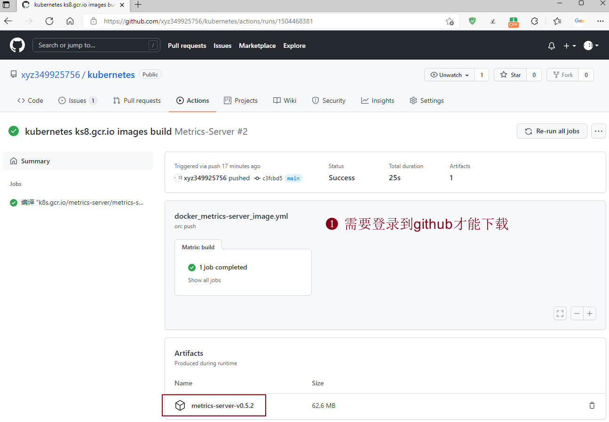
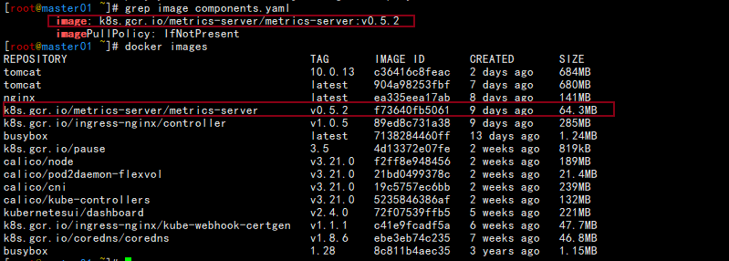
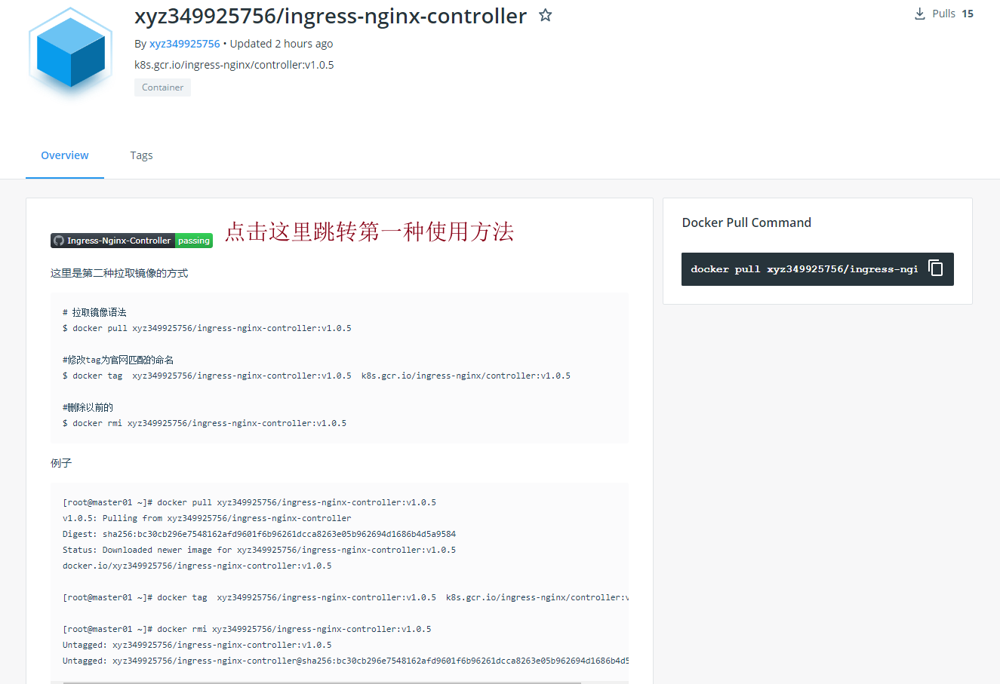

直接下载镜像：

[](https://github.com/xyz349925756/kubernetes/actions/workflows/docker_coredns_image.yml)[](https://github.com/xyz349925756/kubernetes/actions/workflows/docker_ingress-nginx-controller_image.yml)[](https://github.com/xyz349925756/kubernetes/actions/workflows/docker_ingress-nginx-kube-webhook-certgen_image.yml)[](https://github.com/xyz349925756/kubernetes/actions/workflows/docker_metrics-server_image.yml)[](https://github.com/xyz349925756/kubernetes/actions/workflows/docker_pause_image.yml)

# 第一种方法

此仓库包含：

```sh
k8s.gcr.io/metrics-server/metrics-server:v0.5.2
k8s.gcr.io/ingress-nginx/controller:v1.0.5
k8s.gcr.io/ingress-nginx/kube-webhook-certgen:v1.1.1
k8s.gcr.io/coredns/coredns:v1.8.6
k8s.gcr.io/pause:3.5
```

==如果你需要帮助可以联系我微信：Fly_349925756==

如果解决了你的问题可以支持一下


# 如何使用？

> 这里我们使用metrics-server为例

## 1.先下载镜像

https://github.com/xyz349925756/kubernetes/actions/runs/1504468381



## 2.上传镜像到装有docker环境的主机

```sh
[root@master01 ~]# docker images
REPOSITORY                                      TAG       IMAGE ID       CREATED       SIZE
tomcat                                          10.0.13   c36416c8feac   2 days ago    684MB
tomcat                                          latest    904a98253fbf   7 days ago    680MB
nginx                                           latest    ea335eea17ab   8 days ago    141MB
k8s.gcr.io/ingress-nginx/controller             v1.0.5    89ed8c731a38   9 days ago    285MB
busybox                                         latest    7138284460ff   13 days ago   1.24MB
k8s.gcr.io/pause                                3.5       4d13372e07fe   2 weeks ago   819kB
calico/node                                     v3.21.0   f2ff8e948456   2 weeks ago   189MB
calico/pod2daemon-flexvol                       v3.21.0   21bd0499378c   2 weeks ago   21.4MB
calico/cni                                      v3.21.0   19c5757ec6bb   2 weeks ago   239MB
calico/kube-controllers                         v3.21.0   5235846386af   2 weeks ago   132MB
kubernetesui/dashboard                          v2.4.0    72f07539ffb5   5 weeks ago   221MB
k8s.gcr.io/ingress-nginx/kube-webhook-certgen   v1.1.1    c41e9fcadf5a   6 weeks ago   47.7MB
k8s.gcr.io/coredns/coredns                      v1.8.6    ebe3eb74c235   7 weeks ago   46.8MB
busybox                                         1.28      8c811b4aec35   3 years ago   1.15MB
[root@master01 ~]# rz -E
rz waiting to receive.

[root@master01 ~]# unzip metrics-server-v0.5.2.zip 
Archive:  metrics-server-v0.5.2.zip
  inflating: metrics-server.tar  
  
[root@master01 ~]# docker load < metrics-server.tar 
6d75f23be3dd: Loading layer [==================================================>]  3.697MB/3.697MB
b2839a50be1a: Loading layer [==================================================>]  61.97MB/61.97MB
Loaded image: k8s.gcr.io/metrics-server/metrics-server:v0.5.2

[root@master01 ~]# docker images
REPOSITORY                                      TAG       IMAGE ID       CREATED       SIZE
tomcat                                          10.0.13   c36416c8feac   2 days ago    684MB
tomcat                                          latest    904a98253fbf   7 days ago    680MB
nginx                                           latest    ea335eea17ab   8 days ago    141MB
k8s.gcr.io/metrics-server/metrics-server        v0.5.2    f73640fb5061   9 days ago    64.3MB
k8s.gcr.io/ingress-nginx/controller             v1.0.5    89ed8c731a38   9 days ago    285MB
busybox                                         latest    7138284460ff   13 days ago   1.24MB
k8s.gcr.io/pause                                3.5       4d13372e07fe   2 weeks ago   819kB
calico/node                                     v3.21.0   f2ff8e948456   2 weeks ago   189MB
calico/pod2daemon-flexvol                       v3.21.0   21bd0499378c   2 weeks ago   21.4MB
calico/cni                                      v3.21.0   19c5757ec6bb   2 weeks ago   239MB
calico/kube-controllers                         v3.21.0   5235846386af   2 weeks ago   132MB
kubernetesui/dashboard                          v2.4.0    72f07539ffb5   5 weeks ago   221MB
k8s.gcr.io/ingress-nginx/kube-webhook-certgen   v1.1.1    c41e9fcadf5a   6 weeks ago   47.7MB
k8s.gcr.io/coredns/coredns                      v1.8.6    ebe3eb74c235   7 weeks ago   46.8MB
busybox                                         1.28      8c811b4aec35   3 years ago   1.15MB

[root@master01 ~]# wget https://github.com/kubernetes-sigs/metrics-server/releases/latest/download/components.yaml

[root@master01 ~]# grep image components.yaml 
        image: k8s.gcr.io/metrics-server/metrics-server:v0.5.2
        imagePullPolicy: IfNotPresent
```



```sh
[root@master01 ~]# kubectl create -f components.yaml 
serviceaccount/metrics-server created
clusterrole.rbac.authorization.k8s.io/system:aggregated-metrics-reader created
clusterrole.rbac.authorization.k8s.io/system:metrics-server created
rolebinding.rbac.authorization.k8s.io/metrics-server-auth-reader created
clusterrolebinding.rbac.authorization.k8s.io/metrics-server:system:auth-delegator created
clusterrolebinding.rbac.authorization.k8s.io/system:metrics-server created
service/metrics-server created
deployment.apps/metrics-server created
apiservice.apiregistration.k8s.io/v1beta1.metrics.k8s.io created

[root@master01 ~]# kubectl get pod -n kube-system 
NAME                                       READY   STATUS    RESTARTS         AGE
calico-kube-controllers-7d7bbc4464-h7wcq   1/1     Running   20 (3h11m ago)   3d14h
calico-node-2sdkt                          1/1     Running   14 (3h11m ago)   4d
calico-node-9vbcn                          1/1     Running   11 (3h11m ago)   4d
coredns-6cf54f794c-7rmgx                   1/1     Running   11 (3h11m ago)   4d
coredns-6cf54f794c-tn5h4                   1/1     Running   11 (3h11m ago)   4d
metrics-server-dbf765b9b-cgxh5             1/1     Running   0                59s

[root@master01 ~]# kubectl top pod -A
NAMESPACE       NAME                                       CPU(cores)   MEMORY(bytes)   
dev             nginx-deployment-694d6c9559-7mdqr          0m           1Mi             
dev             nginx-deployment-694d6c9559-mz5p8          0m           6Mi             
dev             tomcat-deployment-59ffc6d89f-k2pmk         3m           78Mi            
dev             tomcat-deployment-59ffc6d89f-p5kg9         3m           94Mi            
ingress-nginx   ingress-nginx-controller-d6cdcc5d8-bqf8j   3m           91Mi            
kube-system     calico-kube-controllers-7d7bbc4464-h7wcq   9m           18Mi            
kube-system     calico-node-2sdkt                          56m          161Mi           
kube-system     calico-node-9vbcn                          82m          161Mi           
kube-system     coredns-6cf54f794c-7rmgx                   4m           11Mi            
kube-system     coredns-6cf54f794c-tn5h4                   6m           11Mi            
kube-system     metrics-server-dbf765b9b-ftj8w             14m          25Mi            
[root@master01 ~]# kubectl top node
NAME       CPU(cores)   CPU%   MEMORY(bytes)   MEMORY%   
master01   423m         42%    1163Mi          30%       
node01     372m         37%    958Mi           25%    
```

## 3.下载地址

下面的地址点进去再进去下载最新的版本，也可以点击上面的标签访问。

---

**k8s.gcr.io/metrics-server/metrics-server:v0.5.2**

下载地址：https://github.com/xyz349925756/kubernetes/actions/workflows/docker_metrics-server_image.yml

---

**k8s.gcr.io/ingress-nginx/controller:v1.0.5**

https://github.com/xyz349925756/kubernetes/actions/workflows/docker_ingress-nginx-controller_image.yml

---

**k8s.gcr.io/ingress-nginx/kube-webhook-certgen:v1.1.1**

https://github.com/xyz349925756/kubernetes/actions/workflows/docker_ingress-nginx-kube-webhook-certgen_image.yml

---

**k8s.gcr.io/coredns/coredns:v1.8.6**

https://github.com/xyz349925756/kubernetes/actions/workflows/docker_coredns_image.yml

---

**k8s.gcr.io/pause:3.5**

https://github.com/xyz349925756/kubernetes/actions/workflows/docker_pause_image.yml


# 第二种方法

Docker Hub: https://hub.docker.com/r/xyz349925756

​           https://hub.docker.com/u/xyz349925756

详细使用方法点击进去每个镜像里面就可以看到使用方法



拉取k8s.gcr.io国外镜像。

服务版本：linux/amd64  

